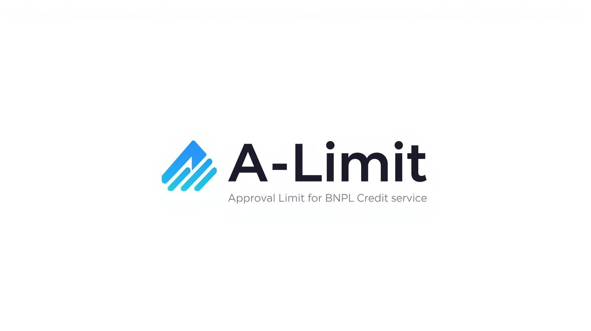

# A-Limit

  

<h1 align="center">A-Limit</h1>

  BNPL Credit Risk Analysis Application

---

## Problem Background
The rapid growth of Buy Now Pay Later (BNPL) services in Fintech, such as ShopeePay, has been very popular in Indonesia since it can be integrated directly into the Shopee ecosystem. While this increases transaction convenience, it significantly raises credit risk. Many platforms still rely on simple rule-based checks that fail to capture the nuances of a customer’s financial health. 

To address this, we have developed a multi-stage modeling pipeline: 
- **Segmenting users** based on behavior
- **Predicting approval** eligibility
- **Optimizing credit limits** to ensure sustainable lending.

## Objectives
1. **Customer Segmentation (Clustering)**    
   To segment users into **Low Risk, Potential Risk, and High Risk** groups based on financial and behavioral characteristics.

2. **Approval Classification**     
   To develop a classification model that predicts whether a customer should be **Approved, Reviewed, or Rejected**, based on their probability of default.

3. **Credit Limit Optimization**    
   To determine a **personalized credit limit** for approved users using financial principles (e.g., affordability ratio) combined with risk-based adjustments.

4. **Deployment for Real-Time Use**    
   To implement the model in a **Streamlit application** for real-time inference and decision support.

## License
This project is open-source and can be used for learning purposes.